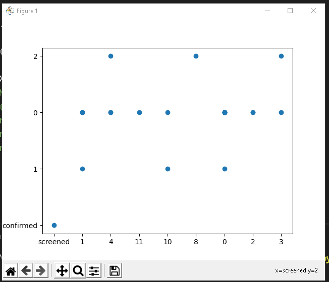
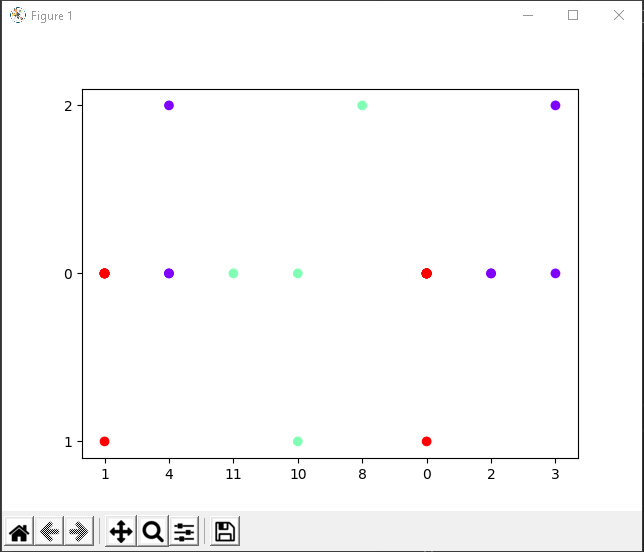
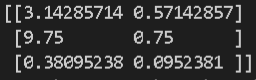
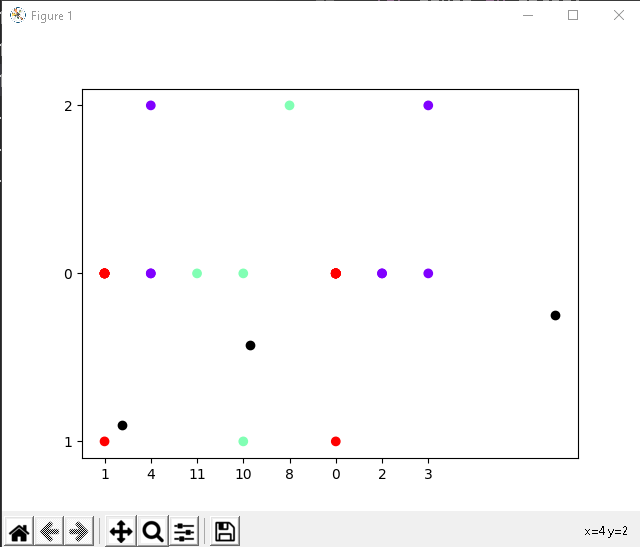
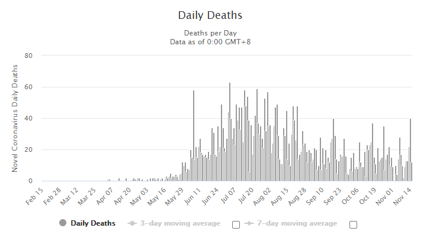
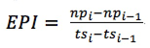

# Coronavirus Data Analysis with Machine Learning
Luis Fernando Espino Barrios and Alvarado Kevin, Cardona Berny, Galicia Nery, Giron Gary, Guarchaj Ottoniel, Hernandez Fernando Antonio, Hevia Eduardo, Lemus Yoselin, Linares Jefferson, Lizama Luis, Lopez Abner, Melgar James, Morales Mario, Morales Oscar, Ordoñez Bryan, Sánchez Sebastián, Solares Cesar, Solares Omar, Vasquez Pavel, Vega Daniel, Veliz Jorge, Villatoro Kherson, Gustavo Ichel, Celso Soto, Velíz José, Alvarado David, López Ivan, Mazariegos Fernando, Calderón Marvin, Siguantay Wilder.\
Universidad de San Carlos de Guatemala\
Technical Report November 2020

## Resume
In the current pandemic that the world is experiencing, COVID-19 has had great variations and tends to be misleading due to the new waves derived from social relaxation, today, there are several
factors that make comparisons between countries difficult, there are differences from one nation to another, as well as undetected or reported cases of the disease, in addition there are different types of tests, detection strategies, but this is limited by the different definitions and forms of classification, such as mild or asymptomatic cases that are not regularly accounted for, because they are not reported, so the quality of care can also be determining, even so it is important to have models with which it is possible to predict behavior of the disease in such a way that preventive measures can be taken at the population level to avoid contagion, as well as taking greater care with people at high risk, in said processes of determining characteristics and factors, different characteristics of the patients in the different analyzes carried out throughout the following report, age, sex, nationality, among others.
Next it will be about how the covid-19 pandemic has evolved since the first day it arrived in Guatemala and some countries in America, such as Honduras, Costa Rica, the United States, and even a comparison with countries on the other side of the world such as China. , addressing questions about the mortality rate, number of people infected per day, percentage of deaths according to active cases.
All the data collected and displayed have been extracted from the public databases of each country that track this information. With this information and using the Python programming language and its Sckit-learn library, it is possible to analyze and predict the data that will be shown below.

## Table of Contents
- [Covid-19 infection trend in Guatemala](#covid-19-infection-trend-in-guatemala) 
- [The Epidemic Progression Index](#The-Epidemic-Progression-Index)
- [Prediction of infecteds in Costa Rica](#prediction-of-infecteds-in-costa-rica)
- [Mortality prediction due to COVID - 19 in the department of Guatemala](#Mortality-prediction-due-to-COVID-19-in-the-department-of-Guatemala)
- [Mortality prediction due to COVID - 19 in Honduras](#mortality-prediction-due-to-covid---19-in-honduras)
- [Trend of number of infected per day in Guatemala](#trend-of-number-of-infected-per-day-in-guatemala)
- [Number of cases per day of covid 19 in the US for 218 days](#number-of-cases-per-day-of-covid-19-in-the-us-for-218-days)
- [Analysis of the number of deaths from coronavirus in Guatemala](#analysis-of-the-number-of-deaths-from-coronavirus-in-guatemala)
- [Covid-19 in Guatemala, cases, predictions for 2021](#covid-19-in-guatemala-cases-predictions-for-2021)
- [Percentage of men infected by covid-19 in Guatemala since the first active case](#percentage-of-men-infected-by-covid-19-in-guatemala-since-the-first-active-case)
- [Average deaths from confirmed cases and age of covid 19 in Guatemala](#average-deaths-from-confirmed-cases-and-age-of-covid-19-in-guatemala)
- [Clusters: Deaths according to regions of Guatemala - Covid 19](#clusters-deaths-according-to-regions-of-guatemala---covid-19)
- [Trend of confirmed Coronavirus cases in the department of Guatemala](#Trend-of-confirmed-Coronavirus-cases-in-the-department-of-Guatemala)
- [Percentage of Deaths vs. total cases in Central America](#percentage-of-deaths-vs-total-cases-in-central-america)
- [Behavioral rate of active cases in relation to the number of deaths in some Caribbean countries](#behavioral-rate-of-active-cases-in-relation-to-the-number-of-deaths-in-some-caribbean-countries)
- [Behavior and classification of people infected by COVID-19 by municipality in Guatemala](#behavior-and-classification-of-people-infected-by-covid-19-by-municipality-in-guatemala)
- [Prediction of deaths on the last day](#prediction-of-deaths-on-the-last-day-of-the-first-year-of-infections-in-guatemala)
- [Growth rate of COVID-19 cases in relation to new daily cases and death rate from COVID-19](#growth-rate-of-covid-19-cases-in-relation-to-new-daily-cases-and-death-rate-from-covid-19)
- [World wide cases and deaths predictions - Neural Network MLPRegressor](#world-wide-cases-and-deaths-predictions---neural-network-mlpregressor)
- [Coronavirus (COVID-19) Mortality Rate in Guatemala](#coronavirus-covid-19-mortality-rate-in-guatemala)
- [COVID-19 death factors in Mexico](#covid-19-death-factors-in-mexico)
- [Finding anomalies in confirmed and screened cases data](#finding-anomalies-in-confirmed-and-screened-cases-data)
- [Comparison between the number of cases detected and the number of tests – US](#comparison-between-the-number-of-cases-detected-and-the-number-of-tests--us)
- [Prediction of deaths per month in the municipality of Chimaltenango](#prediction-of-deaths-per-month-in-the-municipality-of-chimaltenango)
- [Prediction of confirmed cases per day](#prediction-of-confirmed-cases-per-day)
- [Classification of the countries of the Americas according to their management of the pandemic](#classification-of-the-countries-of-the-americas-according-to-their-management-of-the-pandemic)
- [Covid 19 in Mixco, Guatemala](#Covid-19-in-Mixco)
- [Confirmed cases of covid in El Salvador](#confirmed-cases-of-covid-in-el-salvador)
- [Using LSTM to predict COVID cases and mortality in Guatemala] (#Using LSTM to predict COVID infections and mortality in Guatemala)
- [References](#References)


## Covid-19 infection trend in Guatemala

The trend of infections is carried out through two perspectives: one having 30 days of information on infections in Guatemala at the beginning of the pandemic and the trend will be shown at different times.

According to the file [20080862.py](https://github.com/LuisEspino/CoronavirusML/blob/main/src/20080862.py), the first execution was configured to predict infections at 50 days, the official number was 644 infected, although later the Guatemalan Ministry of Health corrected the number of infections by increasing them. So the prediction is approximately correct.

<p align="center">

</p>

The second execution is made for 200 days, according to official data there were 90,968 infected, which indicates that the prediction is correct.

<p align="center">

</p>

As of November, Guatemala is reducing the number of infections, so the prediction may vary. However, depending on what is happening in Europe there could be a second wave of infections in December, adjustments would have to be made to the model so that the prediction remains correct.

For the department of Guatemala, it is projected that by the end of November, the curve of confirmed cases will decrease.

## The Epidemic Progression Index
The Epidemic Progression Index (EPI) is a measure of the percentage of infected people with respect to the number of swabs performed. Since swabs are done to people at risk, the EPI indicates how strong the spread of the epidemic is. The math behind the formula is as follows:
Where np (i) represents the total number of positive cases of coronavirus on day i (for example, today), np (i-1) the total number of positive cases of coronavirus on day i-1 (for example, yesterday ), ts (i) the total number of swabs made on day i and ts (i-1) the total number of swabs on day i-1. EPI is a number between 0 and 1. When EPI is equal to 1, it means that all people who have had a swab are positive for the coronavirus. Therefore, the epidemics continue to advance. In contrast, an EPI value equal to 0 means that the epidemics stop, that is, all the people who had a swab are negative for the coronavirus.


## Prediction of infecteds in Costa Rica

In the case of Costa Rica, it had a different behavior since the growth curve of the infected behaved rather in the way of a polynomial of degree 4, that is, it can stabilize and begin a decline.

The degree of the polynomial has an R2 of 0.9989, that is, the data does fit the model. Also with grade 5 R2 is even closer to 0.9998, but the behavior does not correspond to a pandemic, because it goes down too quickly, without stabilizing.

| Polynomial | R2     | RMSE    |
| ---------- | ------ | ------- |
| Grade 4    | 0.9989 | 1184.62 |
| Grade 5    | 0.9998 | 461.72  |

It can be seen in the table that the mean square error RMSE is a lower value in the polynomial of degree 5, this means, that it is a better fit to the graph, also R2 is closer to 1, however, the behavior from a pandemic it cannot be taken down immediately, but the cases are decreasing little by little and the graph is gradually flattening out.

With the above, it can be determined that the degree of the polynomial must be 4 and discard the degree of 5.

<p align="center">

</p>

According to the graph, we can observe that indeed, in the next 50 days, the advance of the infected will continue but could begin to stabilize, which is encouraging for the neighboring country.

| Day  | Date      | Infecteds | Data       |
| ---- | ----------| --------- | ---------- |
| 1    | 06/03/20  | 1         | Real       |
| 248  | 08/11/20  | 116,363   | Real       |
| 300  | 31/12/20  | 160,000   | Prediction |

With the above it is observed that by day 300, the number of infected will be close to 160,000 people, that is, it will continue to increase. That is, Costa Rica will close the year with about 160,000 infected.

The data used for the elaboration of the graph was obtained from [COVID-19 Data Repository by the Center for Systems Science and Engineering (CSSE) at Johns Hopkins University](https://github.com/CSSEGISandData/COVID-19) In the case of Costa Rica, the first day for the graph is taken on March 5, 2020 with zero infected, and the final data of the graph is for November 8, 2020 with 116,363 infected, for a total of 249 days sample history.

The code used to generate the graph is [201503821.py](https://github.com/LuisEspino/CoronavirusML/blob/main/src/201503821.py), which is based on a linear regression, with a polynomial of degree 4.

Control measures
The government has declared a color coded alert system for the control and containment of the pandemic, as follows:

Green (Information): No reported cases, but neighboring countries exposed.
Yellow (Moderated): Accelerated increasing of epidemiological variables, high hospital occupancy, low control of cases.
Orange (High): Increasing of epidemiological variables, medium hospital occupancy, acceptable control of cases.
Red (Extreme): Extreme hospital occupancy.
The epidemiological variables are:

Canton risk by attack rate (weekly): New cases by canton population divided by new national cases, 66% of weight.
Slope and variation coefficient (triweekly): Weekly increase or decrease in the active cases of a canton, 33% of weight.
More specific details, formulas or algorithms for the alert color designation of the cantons or districts have been kept secret and has not been released as of July 2020, which has been contested by local government of the cantons, commerce associations, journalists and open data activists.

As of August 2020, only Yellow Alert or Orange Alert has been used to designate the administrative areas of the country, with differentiated restrictions on each area.


### Comparative analysis of coronavirus cases between Costa Rica and Guatemala

Costa Rica has 5 million inhabitants, they have as of today, November 13, 2020, 120,939 cases of coronavirus, while Guatemala on the same day today with a population of 17 million inhabitants, have 113,543 cases of coronavirus. In other words, Costa Rica has more cases, when they are practically a third of the inhabitants that Guatemala has, this indicates that the sanitary measures taken by each of the people and the responsibility of each of them has made the difference between both countries to avoid contagions.

|                  | Guatemala  | Costa Rica |
| ---------------- | ---------- | ---------- |
| Population       | 17,250,000 | 4,999,000  |
| Infecteds        | 113,543    | 120,939    |
| Percentage       | 0.66%      | 2.41%      |

It is evident that Costa Rica has more cases of infected compared to Guatemala, which indicates that Guatemala has contained the disease in a better way and the restrictive measures have really helped.

### Explanation of the code used for the prediction of infected in Costa Rica

- [201503821.py](https://github.com/LuisEspino/CoronavirusML/blob/main/src/201503821.py)

The code was developed in Python using the Scikit Learn library, in this case a linear regression model was used, through a polynomial function of degree 4. The idea is to find a trend of the currently existing points and fit to test and error one degree for the polynomial, that is, this degree will coincide with the input data, once done it is possible to extend the data over time and make a prediction of the infected.

For this case, first a grade 5 was used, and the fit was very good, but when interpreting that it is a pandemic, the behavior was not correct, therefore another grade was sought, in this case 4, which also presents a good fit, and its behavior in more similar to that of pandemics.

## Mortality prediction due to COVID - 19 in the department of Guatemala

### Resume

As days go by we will be able to determine a more accurate solution, by discovering the determined behavior, for the development corelated to the the excecuted solution. The mortality of this pandemic, which started to spread world-wide since december of 2019, prediction based on a linear regression, indicates that the outcome of whether there is a second wave derived from social relaxation related to the current decrease in social restrictions and curfews which were rendered without effect since the past month of october.

The solution of a development corresponding to the prediction that can determine the behavior that will continue to have as the days go by was executed, the mortality of the pandemic that affects the country and has spread worldwide since December of last year, this based in a linear regression, for which the results of said prediction are committed to whether there is a second wave derived from the social relaxation that is currently being experienced based on the drop in restrictions and curfews that have been without effect since the previous month .

Using linear regression, a projection of deaths was made from the deaths of the first 200 days since the pandemic began.

The data on the deceased persons were downloaded from the portal of the Ministry of Public Health and Social Assistance of Gautemala. These range from March 13 to November 8, 2020.

The pandemic that we are experiencing today has greatly changed the way people live and although the social fear that it represented has already diminished, it is still a threat to society, especially for those people who are already over 60 years old, have obesity , diabetes, heart disease and so on, that make them more vulnerable, that they should be cared for even more, having more protection measures because in any case they become infected can be a great risk to their life.
The reason why the prediction of deaths in the department of Guatemala is relevant is derived from the fact that with it the death rate can be calculated to which the results that are being expressed in the software are added, in such a way that can predict the amount and speed with which the virus is taking the lives of the most affected people, so that entities such as the government can take action and respond immediately or in advance preferably for any eventuality or change in the behavior currently registered, in such a way that it can spread on a smaller scale as well as control the cases of deaths due to COVID 19 which are presented daily with the respective values ​​that are recorded as there are changes in the information.

As can be seen in the graph below, the level of contagion worldwide is high and despite being Central America a territory with populations not as dense as other parts of the world, it is possible to identify that there is a great increase and impact of the pandemic:
<p align="center">

</p>

### Background
A clear indication of any infectious type disease, especially those that are caused by new pathogens such as SARS-CoV-2, tends to be severity since as a last resort it is measured by its killing capacity, this rate It can help to understand how serious this infectious virus can be, it even gives a vision of those who may be individuals at risk for the disease, either due to advanced age, or other previous health problems that can increase the severity of the virus, in such a way that if you have an estimate of such information, you can have a health assessment of care to prevent the greatest number of cases of death.

Currently there are several models by which the level of mortality in people, who have a tragic outcome, can be measured, for these models one of the two best known measures is surely used:
- The infection fatality ratio (known as IFR) that estimates the proportion of deaths among all people who have been infected.
- The case fatality ratio (known as CFR) which it measures is the proportional relationship between deaths and confirmed cases.

If the IFR method is followed for the measurement with accuracy, it is necessary to take into account that you must have a thorough knowledge of the infections and deaths that have been caused and derived from this virus. As a result, in the early phases of an epidemic, mostly a pandemic, the estimates of fatality motives have been based on the cases that have been detected through observation and they have been calculated through statistical methods, which leads to having estimates of the CFR rate that can range from less than 0.1% to even 25%.

In Covid-19, as with many other infectious diseases, the level with which it is spread is surely underestimated because it is not possible to identify a sample that is considerable from the population of infections in people, it may be because it is automatic Or it could be because they only have signs of mild symptoms, even that they are asymptomatic, therefore, because there is no seriousness, they do not go to the doctor or health centers. There may be groups of people who are not cared for or only partially, due to financial resources, means or other circumstances that prevent them from having the same opportunities to access medical care or to be tested for contagion. The detection of cases is closely related during the epidemic, since the ability to take a test is limited, mostly happening in complex and serious cases such as high-risk people such as the elderly or previous diseases, so it is also possible that the cases were misdiagnosed and some other situation or disease with a similar medical presentation is attributed to them, such as in this case a cold, lung infection, or respiratory disease.

The greatest difference found between groups of people and countries according to mortality is an indirect index of the relative risk that this population has of death that helps us to guide and determine decisions regarding the allocation of resources that should be used for this purpose, during the current COVID-19 pandemic, the main objective of the measurements and this analysis and prediction of deaths for the department of Guatemala, seeks to help verify the CFR at the department level, and even direct the investigator to the IFR to a higher accuracy, taking into account biases and that these data and their validity due to the fact that it is a linear regression is compressed to the emergence of a new wave.

#### Terminology note provided by the World Health Organization:
"The acronym CFR, applied to the measurement of the number of deaths among all people with a disease, usually means' rate
of case fatality ”, although properly speaking this expression is incorrect, since“ rate ”implies a time component
which is absent in the case of the CFR. Some authors have tried to rectify this inconsistency using the expressions
«Case fatality ratio» or «case case fatality ratio» (contrary to the proportion, in the ratio the numerator
it does not have to be a subset of the denominator). The expression «risk of case fatality», used with less
frequency is only correct if the duration of clinical disease is known. In this document we will use the expression
«Case fatality ratio». "

### Description of the solution for predicting deaths from COVID-19
The trend of deaths due to the COVID-19 pandemic is made with the information provided by the Ministry of Health of the Republic of Guatemala since March 13, the date on which the first case entered the country, for which there are several months of information retained within the solution as cases of deaths derived from this disease have been reported, with which a trend is set and the prediction can be made by means of a linear model.

According to the 201403997.py file, if it is executed with a configuration to predict the next 30 days, a constant decrease in the number of deaths can be noticed with respect to how the behavior has come, derived from the fact that there has been a substantial drop in the infected and fatality in these last days of the disease, following this model linearly, we can define that cases will continue to decrease, unless there is a second wave of infections in the country, which surely would not be as aggressive as the first but would change the statistics with which they are working and therefore the results of the predictions, this behavior can be verified in the following graph, which shows how the number of deaths has been fluctuating, and was increasing at a certain time, but at the moment already It has decreased and as the days go by we see that the deaths in the capital city associated with SARS-CoV-2 will continue to decrease:
<p align="center">

</p>

The sample taken from the Ministry of Health according to its data collected is from February 13, until November 8 inclusive, in which for the department of Guatemala it was placed in a cumulative way to be able to work with the linspace tool of the numpy library that provides a linear regression from the data entered, so that it could be verified how the death trend would be.
<p align="center">

</p>

Additional in the code the information is mapped from February 13, until November 8 inclusive of the other departments where there is a list according to the days that the cases were reported, if at a certain moment you want to use the solution to handle a prediction of the other departments.
It can be verified in the following image, which shows the results of the number of deaths due to:
<p align="center">

</p>

As is well known in the case of Guatemala in the month of November and what has been in recent weeks there has been a decreasing fall in cases that end in death, for which the model tends to decrease steadily, although it is always It should take into account that according to the data and reports available in Asian and European countries, there is a high probability that there is a second wave, in which case some adjustments would have to be made to the model so that its prediction follows its correct course.
For now it is determined that in the department of Guatemala the number of deaths caused by COVID-19 is declining, in such a way that the country is entering what was defined from the beginning as the new normal.


## Mortality prediction due to COVID - 19 in Honduras

The prediction was made on the 293rd day and deals with the number of deaths predicted for the 350th day after the COVID-19 in Honduras. According to the file [201313819.py](https://github.com/LuisEspino/CoronavirusML/blob/main/src/201313819.py), it can be seen that the death curve has not been flattened and if the necessary measures are not taken, it may follow the flow of this prediction and on day 350 the mortality figure due to the virus would reach 500,000.

<p align="center">

</p>

## Trend of number of infected per day in Guatemala

The analysis is carried out by grouping the number of infected per day according to the number of infected, the day of the pandemic and the current day of the year.

According to the file 201212596.py, It can be seen in the image that 3 groups were created in which the number of infected per day and the days of the current year in which those infected were presented are shown.

With these data we can categorize based on the current day of the year and the number of infected of the day to which group it belongs and obtain an estimate of infections for that day.

<p align="center">
<
   src="https://user-images.githubusercontent.com/13458088/99028380-36ee1880-2535-11eb-8208-321e1d860bd4.png" width="400">
</p>

### Centroid information

Grouping the information in 3 clusters, the k-means algorithm gave us the following information using 3 centroids:

- Centroid 1: 89 infections, 72 days of pandemic, 144 current days of the year.
- Centroid 2: 1067 infections, 120 days of pandemic, 192 current days of the year.
- Centroid 3: 558 infections, 163 pandemic days, 235 current days of the year.

### Data analysis
- Given the data shown for centroid 1, it can be concluded approximately that during the 72 days of the pandemic there were an average of 89 cases per day. 
- For centroid 2, it can be concluded approximately that within 120 days of the pandemic there were an average of 1067 cases per day. 
- For centroid 3, it can be concluded approximately that within 163 days of the pandemic there were an average of 558 cases per day.

With this information we can determine that in the middle of the pandemic it was where the maximum average number of infections per day was reached, being 1067 infected per day, later it presented a decrease to 558 infected per day that would approximately be a decrease of 52% of infections with respect to at average maximum peak.
Based on the previous conclusions, we can predict the number of infections that there will be in a day because we can group it into any of the 3 clusters according to the information entered and determine an approximate average of infections per day.


## Number of cases per day of covid 19 in the US for 218 days

This study is carried out because the United States is the first country with the most registered cases of dovid 19, we talk about the fact that it represents 20% of the cases registered worldwide and taking into account that its population only represents 4%.

In the country there is a record that cases have already been reported in more than 40 states.

For this reason, the following study is carried out and explained on the cases presented in the country during the 218 days.

The linear correlation graph using the polynomial characteristics shows us the behavior of the cases that have been registered in the US, in the first 218 days and we can clearly see the second wave of infections that the country is going through.

<p align="center">

</p>

The graph with the data analyzed during this period of time is shown, as well as the graph with the appropriate degree to model the behavior of the data.

<p align="center">

</p>

For the analysis of cases in the United States, the following page was taken as a reference, from which the data of the first 218 days were taken. [COVID-19 in the US for 218 days](https://espanol.cdc.gov/coronavirus/2019-ncov/cases-updates/previouscases.html)

The data used and the graphs presented for the analysis of cases of covid 19 in the usa can be found here: [201612226.py](https://github.com/LuisEspino/CoronavirusML/blob/main/src/201612226.py)


During the last days the situation of the month the situation in the country focused more on electoral issues, but as we can see the data indicates a new outbreak of massive contagion in the country that alarms many again, including specialists who warn that this It will be a new outbreak with very fast infections, an example of this is a total of 128,000 infections which breaks the new record.

Of the remaining time that Trump has left as president, it is known that he will not change his plan to combat covid 19 which does not have a national closure contemplated, in fact he is hopeful in the supposed vaccine that is expected this list in April 2021.

We can see that the situation is delicate in the country and that the infections will come as a new wave to the country. [rapid growth of COVID-19 in the United States](https://www.infobae.com/america/eeuu/2020/11/13/advierten-por-el-rapido-crecimiento-del-covid-19-en-estados-unidos-en-medio-de-la-transicion-de-poder-entre-joe-bien-y-donald-trump/)


## Analysis of the number of deaths from coronavirus in Guatemala

Simple linear regression is the most used technique, it is a way that allows modeling a relationship between two sets of variables. The result is an equation that can be used to make projections or estimates on the data.

This model is considered a predictor x and a dependent variable or response Y. Suppose that the true relationship between Y and x is a straight line and that observation Y at each level x is a random variable.

Analysis of the number of deaths from coronavirus in Guatemala through a linear regression, which says that when the reported deaths are far from what the actual behavior of said event should be, the analysis was carried out from day 1 to be reported the first case. Until day 226, the day on which 548 cases and 17 deaths were reported, all this always remembering the importance of the data regarding the pandemic and that they are not only numbers but also people who fall victims of this pandemic every day, always remembering the necessary prevention measures so that these types of graphs do not take the form they are taking due to so many deaths.

The training result model is as follows:

Y = 0.0805811339388978X + 7.712448377581117

<p align="center">

</p>

The data used and the graphs presented for the analysis of cases of covid 19 in Guatemala can be found here: [201403624.py](https://github.com/LuisEspino/CoronavirusML/blob/main/src/201403624.py) and [201403624_data.csv](https://github.com/LuisEspino/CoronavirusML/blob/main/data/201403624_data.csv).


## Covid-19 in Guatemala, cases, predictions for 2021

In Guatemala it was predicted that at the end of this year we were going to see the peak of contagions, We have been in November 12 days and cases are seen in a small increase due to the opening of more shops, sales on the street and not the restriction of schedule.

According to the information given by the Ministry of Health and the reports that are exposed to people. It is said that there will be more contagion but the economy cannot be stop, thanks to this, we can predict that not only will a peak come but the quarantine that we already have since March 13 of this year will be extended. The beak that is said to be 2 months, can be extended up to 4 or 5 months.

In order to flatten the curve that we already have throughout all this, people will have to take care of themselves, protect themselves and take care of themselves otherwise, otherwise we will not be able to finish the fight against this virus, let alone finish quarantine.

In the graph below you can see in red line how the first curve that is already we had before is finished, but the other prediction is that cases will increase over time, by 2021 it is expected to have more contagions.

In the predictions given, it will be observed that whenever it is increasing, unless people take care of themselves, the curve will be able to go down in Guatemala.

<p align="center">

</p>

The degree is 10, which is used to control the number of features added so that the prediction is correct and specified.
Reference of: [201313898.py](https://github.com/LuisEspino/CoronavirusML/blob/main/src/201313898.py)

## Percentage of men infected by covid-19 in Guatemala since the first active case

The graphic below shows up how infected cases in mens are increasing and decreasing during the days, we can see how infected cases are shown by blue dots in the graph,
futhermore, we can fit a trend line to these cases using a polynomial function of degree 4, in this way, we have a data correlation of 0.69.
With these related data we could predict active cases in Guatemalan men by day 350 of the pandemic

<p align="center">

</p>

## Comparative between Guatemala, Central America and Japan

As we can appretiate in the graphs above, we notice a trend between Guatemala and Countries in Central when it comes to covid stats, which is somehow expected
since we can find alot of cultural similarities between this countries, but now we will compare them to Japan.
First we need to establish why Japan was the target, there are three main reasons:

1. They started doing quarentine like the rest of the world, then they decided they were just going to have to learn to "live with it" and resumed their daily duties,
   with some added restrictions of course, but this was done at an early stage; meanwhile in Guatemala the quarentine lasted for a longer time, and restrictions were more severe.
2. They way they have dealt with the pandemic has been outstanding, reflecting in the lowest numbers per capita worldwide.
3. Their social standards, which are regarded to be among the best in the world.

So we start by analyzing a Graph which represents the present data, we can clearly see that it represents a steady increase resulting close to an even straight line, with this we can infer that the way covid spread is being controlled is more efficient than in Central America.

<p align="center">

</p>

Now we will analyze the graph created using the file [201222567.py], which makes a prediction aimed to the day 61 that represents November 30 which is the scope of this research, using a polynomial regression, to see if the nature of the previous graph persists or if it alters: 

<p align="center">

</p>

According to the result we can infer that the increase rate represented indicates that the increase in confirmed cases will remain to have a steady growth barely surpassing the 140,000 mark. We can also see that the number of confirmed cases seems to be similar to Guatemala's, but we must take into consideration the population data: 

|                  | Japan      | Guatemala  |
| ---------------- | ---------- | ---------- |
| Population       | 126,500,000| 17,250,000 |
| Cases            | 108,983    | 113,543    |

The population ratio vs the confirmed cases of each country result in a staggering difference, this is also reflected in the behavior shown in the graphs concerning central American countries, indicating as to why Japans seem to be more steady while most of Central America is quite the opposite, also complementing the prediction describing that the pattern in which cases in Japan will arise in a more controlled manner.

Perhaps the best way to mitigate the impact of the most likely inevitable second wave might be benchmarking the successful way in which other countries are fighting this, and we can clearly  see that Japan is a great example according to the predicted outcome.
I Would also like to make a shout out to https://www.worldometers.info/coronavirus/ which is the main source of the data, they have plenty of other categories
and it is constantly being updated, so we can always have a trusted source of information at hand.

## Average deaths from confirmed cases and age of covid 19 in Guatemala

Taking into account the number of deaths, the number of confirmed cases by average age taking into account the years from ten to ten starting at zero and ending
In one hundred, that is, for the first group of data the average age would be five, for the second fifteen and for the last it would be ninety-five. We proceeded to the analysis of
these data using artificial intelligence where by means of the k-means algorithm from the sklearn library using the following data set.

| Number of deaths | Confirmed cases | Average age |
| ---------------- | --------------- | ----------- |
| 31               | 3045            | 5           |
| 21               | 5790            | 15          |
| 107              | 28883           | 25          |
| 209              | 28398           | 35          |
| 479              | 18996           | 45          |
| 757              | 12701           | 55          |
| 1032             | 7673            | 65          |
| 575              | 2317            | 75          |
| 241              | 827             | 85          |
| 41               | 134             | 95          |

Grouping the data by 2 clusters, the result of the k-means algorithm indicates the following:

### Centroid 1

_where each data refers to the mean of the grouped data_

| Number of deaths | Confirmed cases | Average age |
| ---------------- | --------------- | ----------- |
| 385              | 4641            | 56          |

### Centroide 2

_where each data refers to the mean of the grouped data_

| Number of deaths | Confirmed cases | Average age |
| ---------------- | --------------- | ----------- |
| 265              | 25425           | 35          |

### Graph of the previous data


The graph only shows the number of deaths in two dimensions on the "X" axis and the number of confirmed cases on the "Y" axis.

### Analysis of data

From the data shown for centroid 1, it can be said that for every 464 Data analysis1 positive cases with people with an average age of 56 years, 385 will die.

From the data shown for centroid 2, it can be said that for every 25,425 positive cases with people with an average age of 35 years, 265 will die.

What seeing it in a fast way and corobrating what is indicated in a global way, older people are more susceptible to dying, since out of 4641 cases the
8% while of the cases of the youngest people of 25425 cases 1% dies.

With the estimate given above, it is possible to predict the number of deaths that there will be in a hospital, city or any place in general since we can deduce the probability that a person has of dying according to their age and the number of deaths that there will be in a population.

### How to predict

The correct way to find out if a person belongs to one set of data or another is through their age, if their age is closer to 56 years than to 35 years it means that they belong to that set of information, otherwise If your age is closer to 35 years than 56 years, it belongs to the second set of information.

### China, the city where everything started. How are they now?

China is the city where the pandemic started. This year, they experimented a second wave of Covid 19. The objective of this analysis is to determine what was the behavior of the second wave of Covid in China and how long it took to overcome. The analysis begins on January 22, 2020. As can be seen in the following graph, the highest peak of infections was reached in February, with a maximum of 15136 cases of contagion, which represented an anomaly compared to the values recorded in the previous days. This day marked a clear limit in the case of infections, in the following days the policies
taken by the Chinese government were stricter and a began a decrease in daily cases. By March 10, the days in which more than 100 cases were registered were very few. We can say with complete certainty, based on the following graph, that the second wave lasted approximately two months and its peak was one month after the first contagions began to register. Clearly, this decrease in cases was due to stricter health policies and the collaboration of all citizens.

<p align="center">

</p>

The data used for this analysis can be found in [this link](https://github.com/LuisEspino/CoronavirusML/blob/main/src/201602656.py)

### Italy, one of the first affected 

Italy was one of the first countries affected by the Covid-19 pandemic. Italy, like China at the beginning of the year, is experiencing a second wave in which more cases are recorded than there were at the peak of the pandemic. Currently the Italian government is beginning to take actions to reduce the number of infections and flatten the curve again. In the following graph we can see how the curve is taking an exponential behavior.

<p align="center">

</p>

The data used for this analysis can be found in [this link](https://github.com/LuisEspino/CoronavirusML/blob/main/src/201602656.py)

According to the file [20080862.py](https://github.com/LuisEspino/CoronavirusML/blob/main/src/20080862.py), the first execution was configured to predict infections at 50 days, the official number was 644 infected, although later the Guatemalan Ministry of Health corrected the number of infections by increasing them. So the prediction is approximately correct.

## Clusters: Deaths according to regions of Guatemala - Covid 19

According to the file [201403819.py](https://github.com/LuisEspino/CoronavirusML/blob/main/src/201403819.py), there is an anomalous region, since this is where the largest number of deaths.

The Metropolitan region was the first to report the first case of covid. Since then the number of deceased people has increased to all other departments.

The x-axis shown in the graph represents the regions into which Guatemala is divided. The regions are numbered as follows:

- Metropolitan region
- North Region
- North-East Region
- South-East Region
- Central Region
- South-West Region
- North-West Region
- Region Peten

The y-axis represents the number of deaths.

<p align = "center">

</p>

The cluster is divided into three classes, according to the number of registered deaths. The centers of these three classes are presented below

### Centroid information

Grouping the information in 3 clusters, the k-means algorithm gave us the following information using 3 centroids:

- Centroid 1: [3.25    54.1875]
- Centroid 2: [5.    2000.]
- Centroid 3: [2.6    188.2]

Based on the information, we can predict that the number of deaths from covid is most likely to belong to the second cluster according to the information entered.

The sources of the data used are in:
- [Regions](https://aprende.guatemala.com/historia/geografia/regiones-de-guatemala/)
- [Number of deceased](https://tablerocovid.mspas.gob.gt/)

## Trend of confirmed Coronavirus cases in the department of Guatemala

Something important to know, before making this prediction, is that all that can be analyzed and known is the infection status of those who have undergone a test. All other people who have a laboratory confirmed infection are counted as confirmed cases.

To interpret data on confirmed cases in the department of Guatemala, we need to know how many COVID-19 tests the country actually does.

To realize this trend of confirmed cases, the tests are our window to the pandemic and how it is spreading. Without data on who is infected by the virus, we have no way of understanding the pandemic. Without these data, we cannot know if they are doing well and which ones are not reporting cases and deaths.

The prediction will be made using Machine Learning knowledge implementing predictions using Python Scikit-learn in order to see the trend of confirmed cases in the department of Guatemala.

The prediction process was carried out through linear regression, where our data was taken from the department of Guatemala.

In the file [201408603.py] https://github.com/LuisEspino/CoronavirusML/blob/main/src/201408603.py), it can be seen that the data of each municipality was taken from the database data from the Ministry of Public Health and Social Assistance (https://tablerocovid.mspas.gob.gt/).

The data was obtained from March 13 to November 8, 2020, which gives us a trend graph based on the results and confirmed cases in that range.

<p align="center">

</p>

As can be seen in the prediction and in the graph, the predictions for the next days of confirmed cases will continue to grow for the department of Guatemala and for the entire country.

All this prediction depends on how many people perform the test and with this it can be known if they are infected or not. If there is no evidence there is no information.

For this, it is recommended that new measures or forms can be taken to reduce contagion since the curve of this continues to grow.


## Percentage of Deaths vs. total cases in Central America

This study looks at the percentage of Covid-19 cases in total divided by the number of deaths in each Central American country (Guatemala, Honduras, Nicaragua and El Salvador), each country has a different percentage for example:

In El Salvador, the month of July had a number of cases of 18096 and a number of deaths of 773 when dividing the total number of cases by 100, giving us a total of 2.70%, dividing each month the average is 2.77% and with this average we classify each month as above average or below average, in this case the month of July is classified as (No) which means that it is not above average.

This analysis has the purpose of being able to enter the data from other months and that this through skelearn does not say if there is an improvement in the number of deaths or if, on the contrary, the country had a greater amount than the average.

Each country has a different average, which is the following:

|     country      | average | 
| ---------------- | ------- |
| Guatemala        | 3.78%   | 
| El Salvador      | 2.77%   | 
| Nicaragua        | 3.09%   | 
| Honduras         | 2.96%   | 
| Costa Rica       | 4%      | 
| Panama           | 2.06%   | 

For this study we used the months of July, August, September and October.

Document:
[201314716.py](https://github.com/LuisEspino/CoronavirusML/blob/main/2020-11/src/201314716.py)

### Rise in COVID cases base on 4 values for country

Based on the theory that the increase in COVID cases depends on the days of initial quarantine, travel restrictions, the percentage of investment in public spending on health, and the population density, I set myself the task of knowing if an increase could occur in Guatemala. in the cases with a model trained with the Bayes algorithm in the file [201504394.py](https://github.com/LuisEspino/CoronavirusML/blob/main/src/201504394.py).

The data collected can be found in this repository at [201504394.xlsx](https://github.com/LuisEspino/CoronavirusML/blob/main/data/201504394.xlsx). The sources for the data used to train the model are at:
- [Initial quarantine days](https://es.wikipedia.org/wiki/Cuarentena_por_la_pandemia_de_COVID-19)
- [Travel restrictions](https://www.kayak.com.gt/restricciones-de-viaje)
- [Investment in health](https://datosmacro.expansion.com/estado/gasto/salud)
- [Population density](https://datosmacro.expansion.com/demografia/poblacion)
- [Increase in cases](https://news.google.com/covid19/map?hl=es-419&gl=US&ceid=US%3Aes-419)


## Behavioral rate of active cases in relation to the number of deaths in some Caribbean countries

This approach is a little different from the others, since on this occasion we connected in seeing the behavior of active cases with respect to the number of deaths in some Caribbean countries, such as the following that we will mention below.

This time, we will use the Gaussian algorithm to predict whether or not the data we will send as parameters (country, number of active cases, number of deaths) will show an improvement in the country. This would be another way of alerting countries to the behavior of the virus in their region, where they can know whether they have been improving or getting worse in order to take the necessary measures, this with respect to the rate of active cases versus deaths for each month.
For this specific case we use data from the cases registered in:
https://www.worldometers.info/coronavirus/#countries

The months we take into account are from June, July, August, September and October, for the countries of Jamaica, Haiti, Cuba and Bahamas.

For example: In Jamaica in the month of June there are 266 active cases with 9 deaths per covid registered. Therefore, the rate we manage by dividing the 266 active cases into 9 deaths, which gives us a value of 29.55 active cases/deaths. (266/9=29.55). And in Cuba we have recorded that by the month of June there were 174 active cases and 83 deaths, which gives a value of 2.09. So here we can say that the lower the number the more alarming the cases are, because most of the active cases are ending in death.


| COUNTRY          | AVERAGE | 
| ---------------- | ------- |
| Jamaica          | 34.3%   | 
| Haiti      	   | 31.6%   | 
| Cuba        	   | 3.1%    |
| Bahamas          | 17.38%  |   

In the table we can see that Haiti has a lower average, this is due to the fact that in the data taken from the reference, we see a drastic change in the counts of active cases, between the month of June, July and August. This makes the case look alarming there, just as in the rest most active cases end in death. Jamaica, on the other hand, has a higher average number of active cases, since there are more cases registered in that country and only a small number of them end in death. The source code for this approach can be found in the file /src/201020975.py

### Confirmed cases by Latin American countries
The trend of coronavirus infections in Latin America is very important to know its impact.
The original dataset is converted into a regression dataset using multilayer perceptron artificial neural networks. These results describe a model capable of predicting the number of confirmed cases on a date and country in Latin America.

#### Dataset
Dataset used in the model is obtained from a [publicly available repository](https://github.com/CSSEGISandData/COVID-19) operated by the Johns Hopkins University Center for Systems Science and Engineering (JHU CSSE). It contains the data which describe the number of cases defined by province/state, country/region, latitude and longitude for each day since the start of the COVID-19 infections (01-22-2020). It use only the time series confirmed cases global. The dataset that use the model (obtained by the original dataset) contain the data for latin american countries.

#### Model
According to the file [201602822.py](https://github.com/LuisEspino/CoronavirusML/blob/main/src/201602822.py), it use the scikit-learn library with pickle, matplotlib, pandas and numpy packages.
The model use the ReLU activation function and the L-BFGS solver. Consist of four hidden layers and 40 total hidden reurons distributed equally among layers. This model takes the latitude, longitude and days since first case as input data and the number of confirmed cases as output data.

#### Results
The figure shows the comparison of real data and the data predicted by model. It presents a number of cases in a given group (location and date).
<p align="center">

</p>

The maximum of each daily count is plotted.
<p align="center">

</p>

## Behavior and classification of people infected by COVID-19 by municipality in Guatemala

The following prediction, rather than a prediction, is focused on classifying into "groups" the most infected sectors within the departments of Guatemala, in this case, its municipalities.

### Preliminaries
Since last March 13, when the first COVID-19 contagion was detected in Guatemala, the pandemic has been growing steadily in the country until the second week of April, when there was a peak of 39 cases in a single day , and then continue with the marked trend of a score of daily cases. However, since the second week of May, infections began to increase exponentially, from 68 daily cases on May 8 to 370 new cases in a single day on May 24. In June the cases already exceeded a thousand cases a day. And in July, with a new dashboard, the numbers have become even less reliable.

The president, to evaluate his decisions focused on the reopening of the country before the population, paradoxically showed the data of a country with more municipalities on maximum alert, with a red light for more than half of the country.

These indicators come from the COVID19 dashboard that the Ministry of Health and Social Assistance (MSPAS) feeds daily. However, what the president ignored in his presentation was that, although the number of daily infections has decreased compared to previous weeks, the deceased are a figure that is increasing. Deaths from coronavirus have become the biggest challenge in the region.

### Analysis
Based on the foregoing [201213177.py](https://github.com/LuisEspino/CoronavirusML_2020_11/blob/main/src/201213177.py), it can be determined that for the information provided by the country's high command to have logic to be able to make the traffic light classification, they had to group the municipalities based on their infected.

<p align="center">

</p>

This can clearly be done with a prediction using a machine learning algorithm to create the necessary clusters (in this case, the lights of a traffic light) to be able to identify the measures that a municipality can count on depending on its number of infected .

This prediction has the advantage that it is not only based on the data of the day but can also work preventively in order to find a pattern in the data in the future.

### Guatemala Goverment Alert Level System - Bayes Naive Classification

The government of Guatemala manages the restrictions that are applied in each municipality and economic activity according to a system called "Semaforo". This system is based on 3 factors which are: Rate per 100k inhabitants, Percentage of positive tests and Rate of tests per 1k inhabitants. So, depending on this 3 factor the goverment set the alert lavel and take measures.


For example:

| Rate per 100k inhabitans | % Positive tests | Rate of tests per 1k inhabitants | Alert Level |
| ------------------------ | ---------------- | -------------------------------- | ----------- |
| 14.65                    | 13.56            | 0.05                             | 5           |


Using the data provided by the goverment on [this site](https://covid19.gob.gt/semaforo.html), We make a clasification model based on Naive Bayes (GaussianNB) algorithm to classify the alert level for future results of the 3 factors. 

The alert level is in a scale from 1 to 10, according to the data, alert level can take levels in step of .5 meaning that can be levels like 4.5 or 9.5, thats why in we use LabelEncoder from Sklearn to make this values unique and have a more consistent scale.

In our tests we get the following values:

| Rate per 100k inhabitans | % Positive tests | Rate of tests per 1k inhabitants | Alert Level |
| ------------------------ | ---------------- | -------------------------------- | ----------- |
| 119.44                   | 11.50            | 0.74                             | 7           |
| 25.65                    | 11.20            | 0.16                             | 6           |
| 50.0                     | 5.0              | 0.20                             | 7           |

| Precision |
| --------- |
| 0.6823529 |

The first result row was an already known value (7) , this one was for control, the model have a precision on 68.23529%, we are aware that this model can be more precise but due to the actual data inconsitency on data capture we can not asure more precision.

Source Code [200714832.py]
Data File [200714832.xlsx]

## Prediction of deaths on the last day of the first year of infections in Guatemala

According to the data collected, of the number of deaths per day, on the website of the Ministry of Health and Social Assistance (https://tablerocovid.mspas.gob.gt/), such data is used in Python code from the file [201403981.py](https://github.com/LuisEspino/CoronavirusML_2020_11/blob/main/src/201403981.py) to apply an analysis and prediction of how many deaths may occur on the last day of the first year of infections in Guatemala, that is, on day 365 of the pandemic, for which a grade 4 polynomial regression was applied, which predicts a number of 262 deaths approximately by day 365 of the pandemic.

<p align="center">

</p>

## Growth rate of COVID-19 cases in relation to new daily cases and death rate from COVID-19

During this global pandemic, it has been seen that in many countries different strategies have been had to deal with this global emergency, with the use of the K-means algorithm we can segment and analyze data of the different growth rates with respect to the number of people infected daily and the growth rate of deaths

The analysis groups different data from Central American, South American and European countries, this to verify what difference there is between these 3 regions of the world

The growth rate of cases was calculated from the growth with respect to the previous day taking data from the countries Guatemala, Costa Rica, Brazil, Spain and France with a range of dates from November 11 to October 12, the growth rate was determined with the formula ((total cases - total cases previous day) / total cases previous day) * 100

After applying the k-means algorithm, the following graph and the information of the clusters are obtained, the code with which said analysis was created is in the file [201122826.py](https://github.com/LuisEspino/CoronavirusML/blob/main/src/201122826.py) 

<p align="center">

</p>

| Description                                         | Color in graph | 
| --------------------------------------------------- | -------------- |
| Cluster 0 would be the countries of Central America | Purple         |
| Cluster 1 would be the countries of Europe          | Green          |
| Cluster 2 would be the countries of South America   | Red            |

it was determined that the analysis clusters are

| Clusters | Growth rate cases | Number of daily infections | Growth rate deaths |
| -------- | ----------------- | -------------------------- | ------------------ |
|Cluster 0 | 0.72%             | 1758.66                    | 0.73%              |
|Cluster 1 | 3.48%             | 47524.58                   | 1.11%              |
|Cluster 2 | 1.35%             | 23633.27                   | 0.61%              |

### Analysis

The differences between each of the clusters are observed, the Central American cluster has a smaller number of contagion and the growth rates of daily infections and deaths are also smaller, and they grow more in the South American cluster and it grows even more in the europe cluster

We could conclude that the pandemic tends to worsen in countries where the number of daily infections is high, so that the growth rate of daily infections tends to increase and the growth rate of deaths will also tend to increase, according to In the analysis we can say that the number of people infected daily is important to reduce them because it would decrease the rates of infection and the rate of deaths from COVID-19.

## World wide cases and deaths predictions - Neural Network MLPRegressor
According to the information obtained at https://ourworldindata.org/coronavirus, the expansion of covid-19 has been massive, every day there are tens of thousands of cases, so it is necessary to know the global behavior of infections like this also of deaths.

During the first 25 days we could say that the disease was controlled, having less than 1000 cases, but the following 5 days demonstrated the opposite, reaching 6000 cases, from this point the number of cases increased rapidly until reaching 320 days with a total of 53515055, this behavior is observed in the following graph

<p align="center">

</p>

With this information we start the estimation to determine the behavior of the cases worldwide, starting on day 320 in jumps from 5 to 410 we obtain the following
<p align="center">

</p>

With this, we observe that the infections will increase in the following months, we can support this with the fact that in some parts of the world there are new outbreaks, so it is uncertain when the contagion curve would decline.

Continuing with the deaths worldwide, at the beginning we observed a late appearance of deaths, the first one until the 12th and it was increasing slowly, the first month with 6000 infections there were only 130 deaths
<p align="center">

</p>

It must be taken into account that not all cases of covid-19 mean death, so it is normal for the majority of the infected population to survive.

The prediction made for deaths starting on day 320 and ending on day 410 in steps of 5, we observe the following
<p align="center">

</p>

Deaths are complemented with infections, the decrease in deaths will be accompanied by a decrease in cases.


## Coronavirus (COVID-19) Mortality Rate in Guatemala

To calculate the mortality we need:
1. The number of accumulated cases registered regardless of the current situation whether positive or negative.
2. The total number of deceased cases.

### Fatality Rate based on confirmed cases and deaths in Guatemala

According to the data taken from the page of the Ministry of Public Health and Social Assistance (MSPAS) currently there are 114,885 confirmed accumulated cases and a total of 3,932 cases of registered deaths and using the formula of Infection Fatality Rate (IFR) = Deaths / Cases = 3,932/114,885 = 3.4 % (3.4% of people infected with SARS-CoV-2 have a fatal outcome, while 96.6% recover). This without taking into account that in addition to the cases recorded by the MSPAS there are many cases that have not been taken into account because they are asymptomatic (or present with very mild symptoms) and that testing has not been performed on the entire population, only a fraction of the SARS-CoV-2 infected population is detected, then this would significantly reduce the mortality rate.

### Mortality Rate and Probability of Dying

As of November 15, 3,932 people are estimated to have died out of a total population of 17,263,000 in Guatemala. This corresponds to 0.023% crude mortality rate to date, or 23 deaths per 100,000 population, or 1 death every 4,390 people.

### Mortality Rate in one year 

According to the estimates made in [201213336.py](https://github.com/LuisEspino/CoronavirusML/blob/main/src/201213336.py). for July 2021, it is estimated that Guatemala will have a total of 255,556 confirmed cumulative cases and a total of 8,844 deceased cases and using the formula of Infection Fatality Rate (IFR) = Deaths / Cases = 8,844/255,556 = 3.4 % we get the same mortality rate calculated above.

## COVID-19 death factors in Mexico.
It was used as a [dataset](https://www.kaggle.com/tanmoyx/covid19-patient-precondition-dataset) from the [Mexican Government](https://www.gob.mx/salud/documentos/datos-abiertos-152127), this contains patient-specific information regarding patients’ history and habits. It was filtered and presented like this:
|     Sex    |     Age    |     Diabetes    |     Obesity    |     Tobacco    |     Death    |
|------------|------------|-----------------|----------------|----------------|--------------|
|     2      |     27     |     2           |     2          |     2          |     2        |
|     2      |     24     |     2           |     2          |     2          |     2        |
|     1      |     54     |     2           |     1          |     2          |     2        |
|     2      |     30     |     2           |     2          |     2          |     2        |
|     1      |     60     |     1           |     2          |     2          |     1        |

The attribute sex represents the gender of the patient, 1 means the patient is female and 2 means the patient is a male. Age is how many years old is the patient. In the following attributes, 1 means yes and 1 means no, for example, 1 in tobacco represents that the patient is/was a smoker. 

### Analysis
|     Sex    |     Age    |     Diabetes    |     Obesity    |     Tobacco    |     Death    |
|------------|------------|-----------------|----------------|----------------|--------------|
|     2      |     27     |     2           |     2          |     2          |     **2**        |
|     2      |     24     |     2           |     2          |     2          |    **2**        |
|     1      |     54     |     2           |     1          |     2          |     **2**        |
|     2      |     30     |     2           |     2          |     2          |     **2**        |
|     1      |     60     |     1           |     2          |     2          |     **1**        |

The death attribute means that the patient has died, it will be treated like the dependent variable that will be determined by another five independent variables: sex, age, diabetes, obesity, and tobacco. To make this, it will be applied the Bayes Method to make this binary classification.

### Conclusion
After applying this method using a 5000-record dataset with 80% of data to train and the rest to test, it has the following result: <br>
Source Code: [201603014.py] <br>
Confusion matrix: <br>

<p align="center">

</p>

| Accuracy Rate: | 81.52% |
|----------------|--------|

| Error Rate:    | 18.48% |
|----------------|--------|

Given the accuracy rate, it is not possible to predict a death due COVID-19, but it is possible to estimate death risk with these attributes. Getting to these conclusion it’s a delicate matter but the data analysis and the machine learning can make an estimate prediction that make us easier the task of identify  patients with a higher risk, using the presented attributes we  can make a prediction if a patient is in risk of death. <br> <br>

## Finding anomalies in confirmed and screened cases data

The public information about COVID-19 situation in Guatemala country, found on the [Official Government website](https://tablerocovid.mspas.gob.gt/), contains different amount of data classified by 'Confirmed cases per town and date of issuance of results', 'Confirmed cases per town and symptom onset date', 'Screened cases per town and date of issuance of results', 'Screened cases per town and symptom onset date', and so on.

There are different tools, that are part of Machine Learning, useful for analizyng these data. k-means clustering is one of this tools, used to find anomalies on data sets. By anomaly we mean a value that does not follow the data set trend and it may occur for many factors: human errors, for example. 

Using [Scikit-learn](https://scikit-learn.org/stable/), a powerful machine learning library for Python, k-means clustering included in Scikit-learn library and the data from 'Confirmed cases' and 'Screened cases' in a specific month we could found anomalies in the data set. For this example, we used the information between 15-03-2020 and 15-04-2020, we obtain the next graph generated by this [code](src/201114705.py).

<div align="center">

</div>

The graph above shows the values on a plane. 

The next graph shows the data arranged on three clusters; each cluster associated with one color. 

<div align="center">

</div>

The next graph shows the centroids obtained with the library.

<div align="center">

</div>


<div align="center">

</div>

And the last one graph shows all previous graphs together. 
We can identify at least six anomalies. This may occur for many factors like screening time, human error as we said before, and many more.

We could use another Machine Learning tools to get better results: verify the relationship between screened and confirmed cases, linear and polynomial models to validate the data sets, and so on.

### Alma from Fundegua and Daily Deaths

-Alma is a chatbot that offers helps a far away community at San Pedro la Laguna Guatemala, in order to take what happen with all members of community, Alma provides asistance and recommendations from Call Center and ChatBot web, in order to help a far away community.

<div align="center">

</div>

### World Health Organization (WHO)

COVID-19 is an infectious disease, it creates severe damage in the lungs. COVID-19 causes illness in humans and has killed many people in the entire world. However, this virus is reported as a pandemic by the World Health Organization (WHO) and all countries are trying to control and lockdown all places.

### The Epidemic Progression Index (EPI)

The Epidemic Progression Index (EPI) is a measure of the percentage of infected people with respect to the number of swabs performed. Since swabs are done to people at risk, the EPI indicates how strong the spread of the epidemic is. The math behind the formula is as follows:

<div align="center">

</div>

Where np (i) represents the total number of positive cases of coronavirus on day i (for example, today), np (i-1) the total number of positive cases of coronavirus on day i-1 (for example, yesterday ), ts (i) the total number of swabs made on day i and ts (i-1) the total number of swabs on day i-1. EPI is a number between 0 and 1. When EPI is equal to 1, it means that all people who have had a swab are positive for the coronavirus. Therefore, the epidemics continue to advance. In contrast, an EPI value equal to 0 means that the epidemics stop, that is, all the people who had a swab are negative for the coronavirus.

## Comparison between the number of cases detected and the number of tests – US

The data and graphs shown in the following report are generated in the file: [201602959.py](https://github.com/LuisEspino/CoronavirusML/blob/main/src/201602959.py)

*All data and graphics were generated on November 15, 2020, to obtain real data it is necessary to execute the file specified above.*

API: https://covidtracking.com/data/api

### Abstract
COVID-19 is the most recently discovered infectious disease caused by the coronavirus. Both this new virus and the disease it causes were unknown before the outbreak broke out in Wuhan, China, on December 2019. Currently COVID-19 is a pandemic that affects all countries around the world.

In the following report, a comparison is made between the number of tests and the number of positive cases found to measure the effectiveness of the tests and the level of spread of the virus and how real the data from tests performed is.
All the information used in this report is obtained from a free api, with the objective of having the most up-to-date information possible and as much information as possible in real time.

### Number of cases detected VS the number of tests
The number of positive cases of coronavirus in the United States increases every day, but what is the real number of infected?
Of course, for this, it is necessary to evaluate asymptomatic cases (cases that do not present symptoms but do carry the virus), but this goes beyond the analysis of this report.

To answer the question asked above it is necessary to see the following graph:
<p align="center">
    
</p>


In the previous graph you can see the increase in tests performed on the x axis and the increase in cases on the y axis.

As you can see, both data have an acceptable relationship, but the first grouping (cyan color), you can see a small irregularity, an increase in cases while the increase in tests remained the same.
If you continue with the analysis of the following grouping (red color), the same phenomenon can be observed, with less impact but longer duration.

And in the last grouping (purple color), it is where there is a large number of tests and a large amount of increase in positive cases, even this grouping can be observed an increase in the growth of the data, but the data that increases with the faster the confirmed positive cases.

#### With the above data, 3 classifications can be made:

1. Cluster 1 (cyan), in this phase a greater number of tests was necessary to obtain the exact number of cases and thus be able to take the necessary measures to contain the virus.
The centroid of this phase would be: 107,376 infected and 12,850 tested.

2. Cluster 2 (red), in this phase it can be classified as normal in which the number of tests grows as the number of positive cases grows.
The centroid of this phase would be: 698,852 infected and 41,530 tested.


3. Cluster 3 (purple), in this phase, due to the number of infected people that grow to a large extent, it is not possible to carry out all the tests you want, so it is recommended to maintain the number of tests and intensify precautionary measures, with the objective is that the number of cases decreases and to be able to obtain a more real infected result.
The centroid of this phase would be: 1,185,272 infected and 73,454 tested.

Below, you can see the centroids and the final graph:

### Centroids:
| Phase | Centroid                   |
| ------| -------------------------- |
| 1          | 107375.62, 12849.76   |
| 2          |  698852.07, 41529.65  |
| 3          | 1185272.05, 73453.52  |


### Final Graph:
<p align="center">
    
</p>

### Conclusions:
- The amount of evidence in relation to the number of positive cases is quite good, but in some phases it could be intensified to obtain a more realistic data.
- The amount of positive tests and cases detected is not relevant if the government does not take the necessary precautionary measures.

## Prediction of deaths per month in the municipality of Chimaltenango
In the following analysis, it is based on the municipality of Chimaltenango in the department of Chimaltenango, according to the data provided by the Ministry of Public Health and Social Assistance, it indicates that the deaths began in the month of April, and are counted until November 2 . The main idea of this study is to use linear regression and establish a prediction based on the data obtained in eight months.
The following figure is presented where the orange points are the data obtained, while the green points are from the data of the model prediction.<br> 

<p align="center">

</p> <br><br>

# Prediction of confirmed cases per day

Covid 19 has hit the world in a devastating way, both in the economic and health fields; Since the virus arrived in our country, cases began to be registered for each day, this number of cases can be found on [this site](https://tablerocovid.mspas.gob.gt) , in these data we can find the data confirmed with result delivered and cases without result delivered.

### Prediction
To carry out this analysis, the file [201113769.csv](https://github.com/LuisEspino/CoronavirusML/blob/main/data/201113769.csv), in which column A, contains the data of the cases with no result delivered and in column B, the data with the result delivered, then, starting from the cases In column A, a prediction is made with a linear Sklearn regression, to determine the number of confirmed cases that should exist for each date. This generates a graph the following graph:

<p align="center">

</p>

### Conclusion
As can be seen in the image, the prediction takes a linear form (blue points) and the real data (red points), actually have very little correlation with the prediction, therefore, if we start from only this prediction, we can conclude that the data provided by the government regarding the Coronavirus are inconsistent in many ways, of course, depending on the algorithm used to make the prediction, the values ​​of this can vary and more closely resemble the real data.

Source Code [201113769.py](https://github.com/LuisEspino/CoronavirusML/blob/main/src/201113769.py)

## Classification of the countries of the Americas according to their management of the pandemic
Each country has had its own management of how to deal with the Coronavirus. These graphs seek to classify the countries of America in 3 groups based on their number of cases per million and their number of deaths per million. Calculation of cases per million is related to the population of each country, so it represents a very useful value to understand the management of the pandemic.

Original information used was retrieved from [this link](https://github.com/owid/covid-19-data/blob/master/public/data/owid-covid-data.csv)
and the data used for this analysis can be found [in](https://github.com/LuisEspino/CoronavirusML/blob/main/data/201504480.py)
### Centroid information
 | Centroid   | total_cases_per_million | total_deaths_per_million |
 | ---------- |      ------------------ |       ------------------ |
 | Centroid 1 |             11545.36369 |                342.85992 | 
 | Centroid 2 |             28973.02918 |                  642.631 | 
 | Centroid 3 |              2445.64804 |                 55.99212 | 
 
 | Centroid   |                                                    |
 | ---------- |      --------------------------------------------- |
 | Centroid 1 |             Less affected countries                | 
 | Centroid 2 |             Countries with medium control          | 
 | Centroid 3 |             Most affected countries                | 
 
### Graph of the data
<p align="center">

</p>

Source Code [201504480.py](https://github.com/LuisEspino/CoronavirusML/blob/main/src/201504480.py)

### Cluster Classification
 |                        Country  | total_cases_per_million | total_deaths_per_million | cluster | 
 |                ---------------- |      ------------------ |       ------------------ | ------- |
 |                        Anguilla |                 199.973 |                    0.000 |       2 |
 |             Antigua and Barbuda |                1368.352 |                   40.846 |       2 |
 |                       Argentina |               28870.640 |                  781.201 |       0 |
 |                           Aruba |               43628.121 |                  412.116 |       0 |
 |                         Bahamas |               18214.969 |                  394.153 |       1 |
 |                        Barbados |                 866.476 |                   24.359 |       2 |
 |                          Belize |               12029.043 |                  221.316 |       1 |
 |                         Bermuda |                3564.948 |                  144.525 |       2 |
 |                         Bolivia |               12265.968 |                  757.387 |       1 |
 | Bonaire Sint Eustatius and Saba |                5911.292 |                  114.412 |       2 |
 |                          Brazil |               27516.820 |                  779.349 |       0 |
 |          British Virgin Islands |                2381.189 |                   33.072 |       2 |
 |                          Canada |                7734.879 |                  288.563 |       1 |
 |                  Cayman Islands |                3864.881 |                   15.216 |       2 |
 |                           Chile |               27708.213 |                  773.009 |       0 |
 |                        Colombia |               23406.771 |                  664.840 |       0 |
 |                      Costa Rica |               24189.290 |                  303.488 |       0 |
 |                            Cuba |                 668.161 |                   11.566 |       2 |
 |                         Curacao |                7964.656 |                   12.188 |       1 |
 |                        Dominica |                 944.563 |                    0.000 |       2 |
 |              Dominican Republic |               12281.174 |                  210.363 |       1 |
 |                         Ecuador |               10181.170 |                  736.664 |       1 |
 |                     El Salvador |                5605.438 |                  160.957 |       2 |
 |                Falkland Islands |                4306.632 |                    0.000 |       2 |
 |                       Greenland |                 299.443 |                    0.000 |       2 |
 |                         Grenada |                 284.396 |                    0.000 |       2 |
 |                       Guatemala |                6403.314 |                  218.804 |       2 |
 |                          Guyana |                6094.902 |                  175.448 |       2 |
 |                           Haiti |                 804.032 |                   20.346 |       2 |
 |                        Honduras |               10354.271 |                  284.918 |       1 |
 |                         Jamaica |                3302.759 |                   77.335 |       2 |
 |                          Mexico |                7781.211 |                  762.095 |       1 |
 |                      Montserrat |                2600.520 |                  200.040 |       2 |
 |                       Nicaragua |                 854.548 |                   23.851 |       2 |
 |                          Panama |               33677.129 |                  664.462 |       0 |
 |                        Paraguay |                9963.505 |                  219.978 |       1 |
 |                            Peru |               28354.463 |                 1066.880 |       0 |
 |                     Puerto Rico |               26882.664 |                  321.933 |       0 |
 |           Saint Kitts and Nevis |                 357.197 |                    0.000 |       2 |
 |                     Saint Lucia |                 882.214 |                   10.892 |       2 |
 |Saint Vincent and the Grenadines |                 703.038 |                    0.000 |       2 |
 |       Sint Maarten (Dutch part) |               21524.183 |                  559.675 |       0 |
 |                        Suriname |                8990.273 |                  194.329 |       1 |
 |             Trinidad and Tobago |                4342.293 |                   80.029 |       2 |
 |        Turks and Caicos Islands |               18596.002 |                  154.967 |       1 |
 |                   United States |               32945.027 |                  741.988 |       0 |
 |    United States Virgin Islands |               13732.607 |                  220.258 |       1 |
 |                         Uruguay |                1139.122 |                   18.424 |       2 |
 |                       Venezuela |                3391.518 |                   29.681 |       2 |
### Analysis of data
The countries that belong to centroid 1 are those that currently have a lower number of cases and deaths based on their population. These are countries that we must consider what actions they have taken against the pandemic and what they have achieved.

The countries of centroid 2 belong to the intermediate group, being those that have not managed to completely control the Coronavirus, but haven't been affected as those of group 3.

The countries in centroid 3 are the most affected, in these should be considered that actions proved the growing increase in the number of cases and deaths.


## Covid 19 in Mixco

Mixco is a town of the Department of Guatemala in Guatemala has a population of 494561 habitants and 
actually has an accumulate incidence of positive cases in a relation of 1739.9 per 100,00 habitants
that represents 1.7399 percent, this percent shows a disminution throw the days but we want to estimate
how could be the tendence for the next days, as we know the Christmas time is just around the corner
and this time much of us visit our family but the number of positive cases can increment, so for that
i recolect the positive cases from the information provided by the Ministery of Public Health and Social
Assistance in Guatemala [here](https://tablerocovid.mspas.gob.gt/) from February 13, until the November 
14, in the Mixco town, i use an algorithm of machine learning called K-Nearest Neighbor, this takes the
observations for the training i took the day of the year with the number of positive cases in Mixco town,
and i try to plot this points in 3 clusters y identified these with "C1", "C2", "C3" classes, and i want
the "C1" class represents the first 160 days of the year; this class is the lower in number of positive 
cases reported, the "C2" class represents until the 210th day; this class takes the most high positive 
cases of the 3 clusters reporting above 150 cases in a day, and the las class "C3" until the 320th day; 
these are the medium class about the number of positive cases and actually we are in those days.

The next graph represents the 3 clusters of positive cases in Mixco, during this pandemy.
### Positive cases in Mixco during COVID 19 Pandemy
<p align="center">
    
</p>


Well i want to determinate if the number of positive cases on December 25, could be above 100, using
these algorithm, as we can see the graph if our prediction could be correct the class of the result 
should be C2, so using the algorithm codified in python [here](src/201504448.py), we get the next result.

```python
# Centroides
 [[191.30379747  71.03797468]
 [ 95.14159292   4.26548673]
 [272.02380952  29.89285714]]


# Result of predict that the day 360 and the number of positive cases should be 100 is
['C3']
```

The result shows C3 class, for that reason we can assume that on December 25, the number of 
positive cases can't be 100.


## Confirmed cases of covid in El Salvador

Countries in Central America have the covid disease relatively controlled, but most countries have not yet found the peak of the contagion of this disease.
Countries with a good economy and a health system like Costa Rica are having problems controlling the disease, while a country like El Salvador with a population similar to that of Costa Rica has 35k infected with a population of 6M people.
<p align="center">

</p>
The image above shows the graph of the accumulated cases from January 22 to November 10 and the prediction of the graph 30 days later, approximately 320 days, we can see that the graph begins to fall, which shows that the disease reached its peak.

### Possible reasons

While the Central American countries relax their measures, such as in Guatemala, which decided to remove the state of emergency around the covid, restricting agglomerations such as public transport, shopping centers and opening hospitals with good sustenance, another point to take into account was the severe quarantine to which the country submitted.

The data used for this analysis can be found in [this link](https://github.com/LuisEspino/CoronavirusML/blob/main/src/201603166.py)

## Adjustment figures in Guatemala
From 30 March 2020 until 18 July 2020, cases are recorded on the day before (March 29) it was reported to the media.

On 18 July 2020, Ministry of Health added more than 3,000 cases to the reports due to errors in typing and reporting. Ministry of Health also adjusted the recovery figures, increasing Guatemala's recovery rates to over 60% (and increasing ever since). Deaths are not affected from adjustment of cases and recoveries.

### Covid-19 data lag demonstration in Guatemala
One of the most important aspects to evaluate in this global pandemic is the data, therefore when an error occurs, the data that is available can be detrimental to finding specific and accurate solutions to contain the pandemic

From the first case of covid-19, March 14, 2020, until the cases of July 18, 2020, the records were presented to the media the next day, however they were not certain.

Through machine learning and with the help of the k-means algorithm in [this link](https://github.com/famt89/CoronavirusML/blob/main/2020-11/src/201020345.py), a graph of the information was obtained in which the lag of this adjustment of July 18, 2020 can be observed, we can see that the data was grouped and it can be noted In the cluster for the month of July 2020, this mismatch in the covid-19 records in Guatemala.

Due to a count and adjustment as of July 18, 2020, there is a lag of detected cases of covid-19 in Guatemala, which can be seen in the following graph:

<p align="center">

</p>

# Using LSTM to predict COVID cases and mortality in Guatemala

The current approach uses LSTM (Long Short-Term Memory) to fit the data. I choose this type of ML algorithm because it achieves state of the art results, this will adapt better to understand the development of the infection.

The problem is phrased as a regression problem, we transform the data from a single column of data into a two-column dataset: the first column containing the days (t) infection/death count and the second column containing next day’s (t+1) infection/date count, to be predicted.

The dataset is divided into two subsets, in the chart we can see the real data in blue, and the predicted model for training data(orange) and test data (green). As we can see, the model did an excellent job of fitting both the training and the test datasets

<p align="center">
    
</p>

Only problem is the spike that was a missreport from the government. The rest seems to fit quite well with 100 epochs. This graph shows positive cases, to fit deaths you must change usercols in line 39 of file [201010425.py](https://github.com/LuisEspino/CoronavirusML/blob/main/2020-11/src/201010425.py)

To use this model to predict values we must pass the X-values as an 3-dimension array with values scaled. This will be added in the next release. 

The error is of 300 persons in testing and 350 in training set.


## References 

- Supervised learning — scikit-learn 0.23.2 documentation. (s. f.). Scikit Learn. Retrieved November 08, 2020, https://scikit-learn.org/stable/supervised_learning.html#supervised-learning
- C. (s. f.). CSSEGISandData/COVID-19. GitHub. Retrieved November 08, 2020, https://github.com/CSSEGISandData/COVID-19
- MLPRegressor — scikit-learn documentation. (s. f.). Scikit Learn. Retrieved November 13, 2020, https://scikit-learn.org/stable/modules/generated/sklearn.neural_network.MLPRegressor.html
- A Beginner’s Guide to Neural Networks in Python. Retrieved November 13, 2020, https://www.springboard.com/blog/beginners-guide-neural-network-in-python-scikit-learn-0-18/

- [scikit-learn - Machine Learning in Python](https://scikit-learn.org/stable/)

- [k-means in python - Step by step](https://www.aprendemachinelearning.com/k-means-en-python-paso-a-paso/)

- [Machine Learning - k-means](http://kunusoft.com/slides/ia1/ia109_ml3/index.php?pic=3)

- [Undestanding regression](https://towardsdatascience.com/understanding-regression-using-covid-19-dataset-detailed-analysis-be7e319e3a50)

- [Online datasets](https://www.worldometers.info/coronavirus/)

- [Predicting Stock Price with LSTM ](https://towardsdatascience.com/predicting-stock-price-with-lstm-13af86a74944)